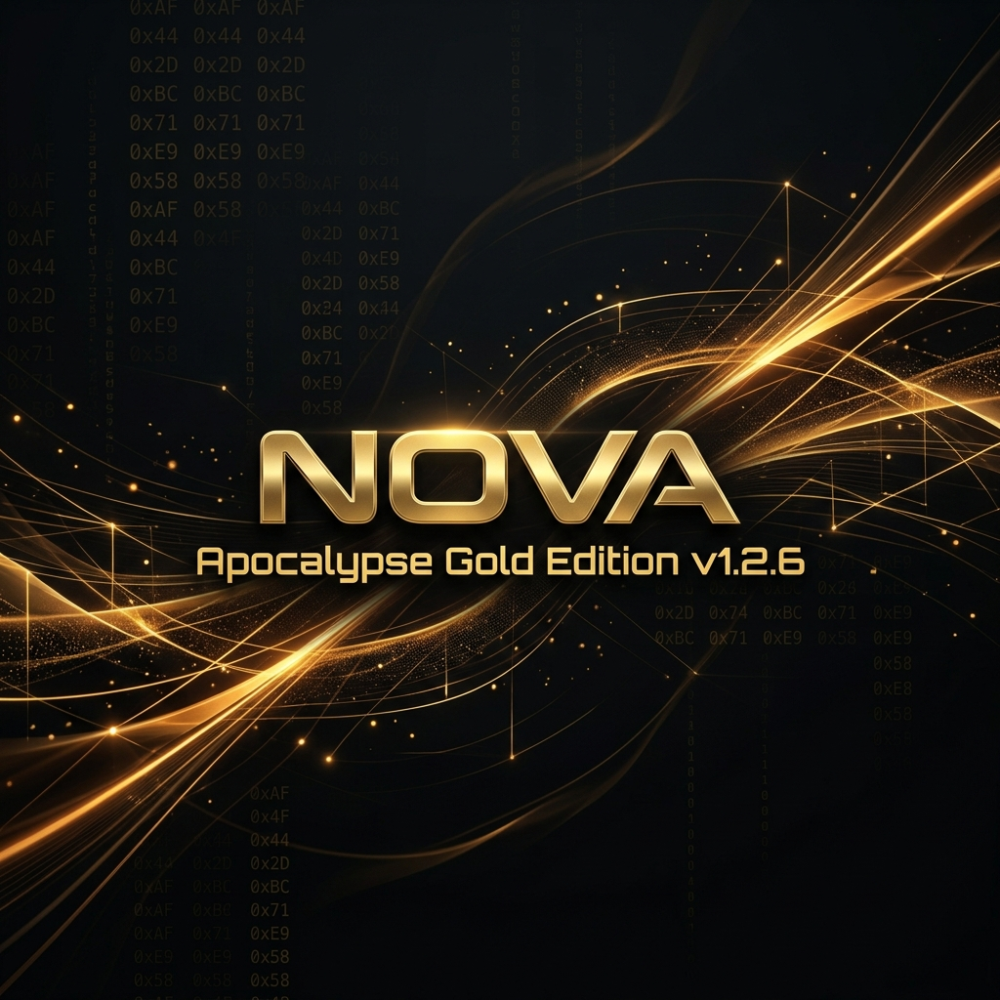

# 🌌 NOX (Nova Operational X-Sentry)
### *M5Stack Donanımları İçin Gelişmiş Ofansif Güvenlik ve Sinyal Manipülasyon Platformu*

<div align="center">

[]()
[]()
[]()
[]()



**NOVA**, M5Stack cihazlarını taşınabilir bir ofansif güvenlik istasyonuna dönüştürür. Kablosuz ağlar, Bluetooth sinyalleri ve HID protokolleri üzerinde doğrudan müdahale ve manipülasyon yapmak için optimize edilmiştir.

[Modüller](#-operasyonel-modüller) • [Teknik Detaylar](#-teknik-mimari) • [Kurulum](#-kurulum-ve-dağıtım) • [Etik Uyarı](#-sorumluluk-reddi)

</div>

---

## 🚀 Operasyonel Modüller

NOVA, saha operasyonları ve sızma testleri için tasarlanmış güçlü saldırı ve spam vektörleri içerir:

### 📡 1. Kablosuz Ağ (WiFi) Operasyonları
*   **Beacon Spam:** Spektrum üzerinde saniyeler içinde yüzlerce sahte SSID (Ağ adı) oluşturarak ağ kirliliği ve stres testi yapar.
*   **Deauthentication:** Hedeflenen WiFi istemcilerinin veya tüm ağın bağlantısını koparmak için yönetim paketleri gönderir.
*   **Nova Captive Portal:** Sahte giriş sayfaları (Phishing) oluşturarak ağ üzerinden kullanıcı verilerini test etmek için HTTP/DNS yönlendirmesi sağlar.

### 📶 2. Bluetooth (BLE) Manipülasyonu
*   **AppleJuice (iOS Spam):** Apple cihazlar üzerinde eşleşme ve kontrol bildirimleri oluşturarak Apple BLE yığınını manipüle eder.
*   **Android/Windows Spam:** SwiftPair ve Google FastPair protokollerini kullanarak cihazlara sürekli bildirim ve eşleşme isteği gönderir.
*   **BLE Sniffer & Flooder:** 2.4GHz Bluetooth paketlerini yakalar ve spektrumu geçersiz paketlerle doldurur.

### ⌨️ 3. HID & USB (BadUSB)
*   **BadUSB Payloads:** Cihaza takılan sistemlerde önceden tanımlanmış komutları (Ducky Script benzeri) ışık hızında çalıştırarak otomatik konfigürasyon veya sızma testi yapar.
*   **HID Analysis:** Bağlı cihazların HID descriptolarını kontrol eder.

### 📺 4. Kızılötesi (IR) Kontrol
*   **TV-B-Gone:** Geniş bir IR kütüphanesi kullanarak her türlü televizyon ve projektörü kapatma veya kontrol etme sinyali gönderir.

---

## 🛠 Teknik Mimari

| Katman | Teknoloji |
| :--- | :--- |
| **İşlemci** | ESP32-S3 (M5StickC Plus2 / Cardputer / StampS3) |
| **Görsel** | M5Unified / M5GFX (Yüksek FPS Boot Animasyonu) |
| **Dil** | C++ / Arduino / PlatformIO |
| **Ağ** | WiFi 802.11 b/g/n & Bluetooth Low Energy (BLE) |

---

## 📦 Kurulum ve Dağıtım

### ⚡ M5Burner İle Yükleme
En pratik yükleme yöntemi:
1.  **M5Burner** uygulamasını indirin ve açın.
2.  Sol menüden cihazınızı seçin.
3.  Arama kutusuna **"Nova"** yazın.
4.  **RedRiveRR** tarafından yayınlanan güncel sürümü **Burn** diyerek cihazınıza atın.

### 💻 Geliştiriciler İçin (Derleme)
```bash
git clone https://github.com/RedRiveRR/M5Stack-NOVA.git
cd M5Stack-NOVA
pio run -t upload
```

---

## ⚖️ Sorumluluk Reddi (Legal Disclaimer)
Bu yazılım sadece **etik siber güvenlik araştırması ve eğitim amaçlı** geliştirilmiştir. İzin alınmamış sistemler, cihazlar veya ağlar üzerinde kullanılması kesinlikle yasaktır ve yasal sonuçlar doğurabilir. Kullanıcı, bu aracın kullanımından doğacak her türlü hukuki ve fiziksel sorumluluğu peşinen kabul eder. **Geliştirici (RedRiveRR), yazılımın kötüye kullanımından sorumlu tutulamaz.**

---

<div align="center">
  Geliştiren: <b><a href="https://github.com/RedRiveRR">RedRiveRR</a></b>
</div>
