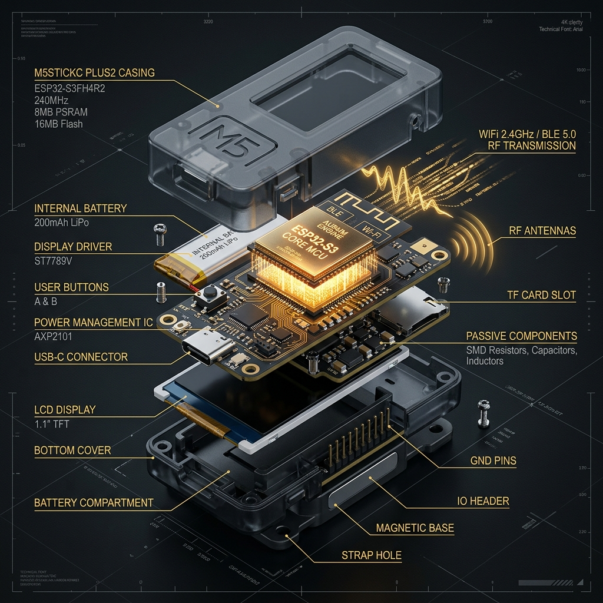

# 🌌 NOVA v1.2.6 Aurum
### *M5Stack Donanımları İçin Gelişmiş Ofansif Güvenlik ve Sinyal Manipülasyon Platformu*

<div align="center">

[]()
[]()
[]()
[]()
[]()

**NOVA**, M5Stack cihazlarını taşınabilir bir ofansif güvenlik istasyonuna dönüştürür. Kablosuz ağlar, Bluetooth sinyalleri ve HID protokolleri üzerinde doğrudan müdahale ve manipülasyon yapmak için optimize edilmiştir.

[Modüller](#-operasyonel-modüller) • [Sistem Mimarisi](#-sistem-mimarisi) • [Warfare Center](#-warfare-center-v12) • [Aurum Core](#-universal-maelstrom-v20) • [Teknik Detaylar](#-teknik-mimari) • [Kurulum](#-kurulum-ve-dağıtım)

</div>

---

## 🏛️ Sistem Mimarisi (Exploded View)

Nova Aurum, donanım gücü ile yazılım zekasının mükemmel birleşiminden oluşur. Aşağıdaki teknik şema, M5StickC Plus2 donanımı üzerindeki **Aurum Engine** çekirdeğini ve sinyal enjeksiyon katmanlarını göstermektedir.

<div align="center">

</div>

### 📡 1. RF & Sinyal Katmanı
Nova Aurum, ESP32-S3'ün dâhili 2.4GHz RF yeteneklerini kullanarak WiFi ve BLE yığınlarını (Stack) doğrudan manipüle eder. Sinyaller, Aurum Core tarafından üretilen yüksek frekanslı paketlerle modüle edilir.

### 🧠 2. Aurum Core Engine
Yazılımın kalbi olan Aurum Core, bellek yönetimini (SRAM) optimize ederek aynı anda binlerce paketi saniyeler içinde spektruma enjekte edebilir. Bu katman, donanım kaynaklarını %100 kapasiteyle "Mission Critical" modunda çalıştırır.

### 🖥️ 3. Taktiksel Arayüz (UI Bridge)
M5Unified kütüphanesi üzerine inşa edilen görsel köprü, karmaşık saldırı verilerini taktiksel bir terminal arayüzüne dönüştürerek kullanıcıya anlık geri bildirim sağlar.

---

## 🚀 Operasyonel Modüller

NOVA, saha operasyonları ve sızma testleri için tasarlanmış güçlü saldırı ve spam vektörleri içerir:

### 📡 1. Kablosuz Ağ (WiFi) Operasyonları
*   **Beacon Spam:** Spektrum üzerinde saniyeler içinde yüzlerce sahte SSID (Ağ adı) oluşturarak ağ kirliliği ve stres testi yapar.
*   **Deauthentication:** Hedeflenen WiFi istemcilerinin veya tüm ağın bağlantısını koparmak için yönetim paketleri gönderir.
*   **Nova Captive Portal:** Sahte giriş sayfaları (Phishing) oluşturarak ağ üzerinden kullanıcı verilerini test etmek için HTTP/DNS yönlendirmesi sağlar.

### 📶 2. Bluetooth (BLE) Manipülasyonu
*   **AppleJuice (iOS Spam):** Apple cihazlar üzerinde eşleşme ve kontrol bildirimleri oluşturarak Apple BLE yığınını manipüle eder.
*   **Android/Windows Spam:** SwiftPair ve Google FastPair protokollerini kullanarak cihazlara sürekli bildirim ve eşleşme isteği gönderir.
*   **BLE Sniffer & Flooder:** 2.4GHz Bluetooth paketlerini yakalar ve spektrumu geçersiz paketlerle doldurur.

### ⚔️ 3. Warfare Center (Savaş Merkezi)
> **v1.2.0'da yeni!** Tüm ofansif BLE modüllerinin toplandığı ana saldırı üssü.

*   **iOS Warfare Suite:** iPhone'lar için optimize edilmiş DoS motoru (AirTag, HomeKit, SA Turbo).
*   **Android Warfare Suite:** Google Fast Pair protokolü üzerinden Android cihazları meşgul eden DoS motoru.
*   **Windows Warfare Suite:** Microsoft Swift Pair protokolü üzerinden Windows 10/11 cihazlarına popup yağdırır (Surface Mouse, Xbox, Klavye taklitleri).

### 🌪️ 4. Universal Maelstrom v2.0 (Aurum Core)
> **v1.2.6 Aurum sürümünde güncellendi!** Nova'nın durdurulamaz en güçlü kaos modu.

*   **9x Burst Mode:** Her döngüde saniyeler içinde 3 Apple, 3 Android ve 3 Windows paketi birden gönderir.
*   **Chaos Counters:** Ekranda hangi platforma kaç bin paket gönderildiğini anlık takip eden canlı sayaçlar.
*   **Apocalypse Intensity:** Sinyal spektrumunu tamamen domine eden yüksek yoğunluklu BLE yayını.

### ⌨️ 5. HID & USB (BadUSB)
*   **BadUSB Payloads:** Cihaza takılan sistemlerde önceden tanımlanmış komutları (Ducky Script benzeri) ışık hızında çalıştırarak otomatik konfigürasyon veya sızma testi yapar.
*   **HID Analysis:** Bağlı cihazların HID descriptor'larını kontrol eder.

### 📺 6. Kızılötesi (IR) Kontrol
*   **TV-B-Gone:** Geniş bir IR kütüphanesi kullanarak her türlü televizyon ve projektörü kapatma veya kontrol etme sinyali gönderir.

### 🛡️ 7. Savunma Modülleri
*   **Deauth Hunter:** Ortamdaki WiFi deauth saldırılarını algılar ve uyarı verir.
*   **BLE Hunter:** Çevredeki şüpheli BLE cihazlarını (Flipper Zero, AirTag tracker vb.) tespit eder.
*   **Pineapple Hunter:** Sahte erişim noktalarını (Evil Twin) tespit etmek için SSID analizi yapar.

---

## 🛠 Teknik Mimari

| Katman | Teknoloji |
| :--- | :--- |
| **İşlemci** | ESP32-S3 (M5StickC Plus2 / Cardputer / StampS3) |
| **Görsel** | M5Unified / M5GFX (Yüksek FPS Boot Animasyonu) |
| **Dil** | C++ / Arduino / PlatformIO |
| **Ağ** | WiFi 802.11 b/g/n & Bluetooth Low Energy (BLE) |
| **iOS Warfare** | Apple Nearby Action (0x0F) / Proximity Pairing (0x07) |
| **Android Warfare** | Google Fast Pair (0xFE2C) |
| **Windows Warfare** | Microsoft Swift Pair (0x0006) |
| **Maelstrom** | Multi-Protocol Chaos Burst (9x per loop) |

---

## 📦 Kurulum ve Dağıtım

### ⚡ M5Burner İle Yükleme
En pratik yükleme yöntemi:
1.  **M5Burner** uygulamasını indirin ve açın.
2.  Sol menüden cihazınızı seçin.
3.  Arama kutusuna **"Nova"** yazın.
4.  **RedRiveRR** tarafından yayınlanan güncel sürümü **Burn** diyerek cihazınıza atın.

### 💻 Geliştiriciler İçin (Derleme)
```bash
git clone https://github.com/RedRiveRR/M5Stack-NOVA.git
cd M5Stack-NOVA
pio run -t upload
```

---

## 📋 Changelog

### v1.1.1 — Android Warfare Suite Beta (2026-04-11)
- ✅ **Android Warfare Suite** eklendi: Fast Pair Flood, Android Mix, Samsung/Pixel Siege
- ✅ Google Fast Pair (0xFE2C) protokolü ile Android bildirim spam desteği
- ✅ 250+ Android modelini içeren veritabanı ile rotasyonel saldırı (Mix Mode)

### v1.1.0 — iOS Warfare DoS Engine (2026-04-11)
- ✅ **iOS Warfare Suite** eklendi: AirTag Phantom, HomeKit Siege, SA Turbo, SA Mix
- ✅ Apple Nearby Action (0x0F) protokolü ile iPhone popup flood
- ✅ Her pakette rastgele auth tag = iOS dedup bypass
- ✅ 15 farklı Apple action type rotasyonu (AppleTV, Vision Pro, HomePod, Apple ID vb.)
- ✅ `applejuice.h` payload'ları 31-byte BLE frame limitine uygun olarak yeniden hesaplandı
- ✅ BLE stack crash koruması (stabilize edilmiş stop→build→start akışı)
- 🔧 AirTag payloads'ı Find My (0x12) protokolüne güncellendi
- 🔧 Proximity Pairing payload boyutları 26 byte'a optimize edildi
- 🔧 Nearby Action payload boyutları 19 byte'a optimize edildi

### v1.0.0 — İlk Sürüm
- 🎉 Nova firmware ilk kararlı sürümü
- WiFi Beacon Spam, Deauth, Captive Portal
- AppleJuice BLE Spam (iOS/Android/Windows)
- TV-B-Gone IR Kontrol
- BadUSB HID Payloads
- Deauth Hunter, BLE Hunter, Pineapple Hunter
- Türkçe arayüz desteği
- Cyberpunk Cyan/Dark tema

---

## ⚖️ Sorumluluk Reddi (Legal Disclaimer)
Bu yazılım sadece **etik siber güvenlik araştırması ve eğitim amaçlı** geliştirilmiştir. İzin alınmamış sistemler, cihazlar veya ağlar üzerinde kullanılması kesinlikle yasaktır ve yasal sonuçlar doğurabilir. Kullanıcı, bu aracın kullanımından doğacak her türlü hukuki ve fiziksel sorumluluğu peşinen kabul eder. **Geliştirici (RedRiveRR), yazılımın kötüye kullanımından sorumlu tutulamaz.**

---

<div align="center">
  <b>NOVA v1.1.1</b> · Geliştiren: <b><a href="https://github.com/RedRiveRR">RedRiveRR</a></b>
</div>
